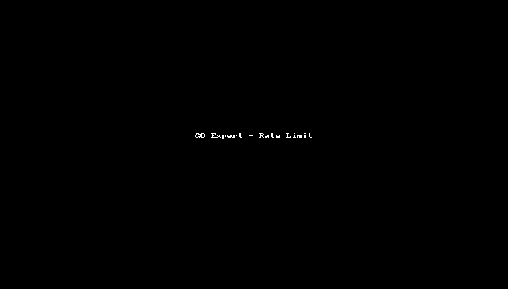

# Rate Limiter Service

Um serviço de rate limiting implementado em Go para controlar o tráfego de requisições HTTP baseado em IP e Token de acesso.

## Funcionalidades

- Limitação por IP
- Limitação por Token (via header `API_KEY`)
- Armazenamento em Redis
- Tempo de bloqueio configurável (diferente para IP e Token)
- Interface de storage extensível

## Configuração

### Variáveis de Ambiente

```env
REDIS_ADDR=redis:6379    # Endereço do Redis
IP_LIMIT=5               # Limite de requisições por IP
TOKEN_LIMIT=10           # Limite de requisições por Token
IP_DURATION=1s           # Intervalo de tempo para reset do limite
IP_BLOCK_TIME=5m         # Tempo de bloqueio para IP após exceder limite
TOKEN_BLOCK_TIME=6m      # Tempo de bloqueio para Token após exceder limite
SERVER_PORT=8080         # Porta do servidor
```

### Prioridade de Limites

1. Se um Token estiver presente no header `API_KEY`, suas configurações têm prioridade absoluta
2. Caso contrário, aplica-se o limite por IP

## Executando com Docker

```bash
docker-compose up --build
```

## Testando o Rate Limiter

### Teste por IP
```bash
# Envie requisições até atingir o limite (5 req/s)
curl localhost:8080

# A 6ª requisição será bloqueada por 5 minutos
```

### Teste por Token
```bash
# Envie requisições com um token até atingir o limite (10 req/s)
curl -H "API_KEY: abc123" localhost:8080

# A 11ª requisição será bloqueada por 6 minutos
```

## Comportamento

1. **Limite Normal**
   - Contador incrementa a cada requisição
   - Reset após o período definido em `IP_DURATION`

2. **Excesso de Requisições**
   - Status: 429
   - Mensagem: "you have reached the maximum number of requests or actions allowed within a certain time frame"
   - Bloqueio conforme configuração:
      - IPs: Bloqueados por `IP_BLOCK_TIME` (padrão: 5m)
      - Tokens: Bloqueados por `TOKEN_BLOCK_TIME` (padrão: 6m)

## Arquitetura

```
├── config/        # Configurações e variáveis de ambiente
├── storage/       # Interface de armazenamento e implementação Redis
├── limiter/       # Lógica core do rate limiting
├── middleware/    # Middleware HTTP para integração
└── main.go        # Ponto de entrada da aplicação
```

## Extensibilidade

Para implementar um novo mecanismo de armazenamento:

1. Implemente a interface `Storage`:
```go
type Storage interface {
    Get(key string) (int, error)
    Set(key string, value int, expiration time.Duration) error
    Incr(key string) error
    IsBlocked(key string) bool
    Block(key string, duration time.Duration) error
}
```

2. Substitua a implementação no `main.go`:
```go
store := NewMyCustomStorage()
rateLimiter := limiter.NewRateLimiter(store)
```

## Testes

### Testes Unitários
Os testes unitários focam na lógica de negócio sem dependências externas:

```bash
# Executar todos os testes unitários
go test ./tests/... -v

# Executar testes com cobertura
go test ./tests/... -coverprofile=coverage.out
go tool cover -html=coverage.out
```

Diretórios de teste:
- `tests/config`: Testa o carregamento de configurações e variáveis de ambiente
- `tests/middleware`: Testa a lógica do middleware de rate limiting
- Todos os testes utilizam mocks para evitar dependências externas

### Testes de Integração
O script `local_test.sh` serve como teste de integração, validando o sistema completo em execução:

```bash
# Iniciar serviços
docker-compose up -d

# Executar testes de integração
./local_test.sh
```

O script de integração testa:
1. Rate limiting por IP:
    - Faz 6 requisições para validar o limite de 5 req/s
    - Verifica o bloqueio na 6ª requisição
    - Confirma o status 429 após bloqueio

2. Rate limiting por Token:
    - Faz 11 requisições com um token para validar o limite de 10 req/s
    - Verifica o bloqueio na 11ª requisição
    - Confirma o status 429 após bloqueio

3. Verifica a persistência do bloqueio:
    - Tenta novas requisições durante o período de bloqueio
    - Confirma que o bloqueio permanece ativo

## Demo




## Licença e Créditos

### Origem do Projeto
Este projeto foi desenvolvido como parte dos desafios propostos no curso MBA Go Expert da Full Cycle, criado e ministrado por Wesley Willians. O desafio faz parte do módulo de rate limiting e tem como objetivo educacional demonstrar conceitos de:
- Rate limiting em Go
- Design de APIs
- Middleware pattern
- Interface segregation
- Clean Architecture
- Testes em Go

### Uso e Responsabilidade
Este código é disponibilizado apenas para fins de estudo e referência. Importante notar que:

- Não há garantias de adequação para uso em produção
- Não há suporte técnico ou manutenção ativa
- O uso em ambiente produtivo é de total responsabilidade do usuário
- Recomenda-se fortemente uma revisão completa e testes extensivos antes de qualquer uso em produção

### Agradecimentos
- Wesley Willians e Full Cycle pelo excelente material e desafios propostos
- Comunidade Go Expert pelo compartilhamento de conhecimento e discussões

### Aviso Legal
O CÓDIGO É FORNECIDO "COMO ESTÁ", SEM GARANTIA DE QUALQUER TIPO, EXPRESSA OU IMPLÍCITA, INCLUINDO, MAS NÃO SE LIMITANDO ÀS GARANTIAS DE COMERCIALIZAÇÃO, ADEQUAÇÃO A UM DETERMINADO FIM E NÃO VIOLAÇÃO. EM NENHUM CASO OS AUTORES OU TITULARES DE DIREITOS AUTORAIS SERÃO RESPONSÁVEIS POR QUALQUER RECLAMAÇÃO, DANOS OU OUTRA RESPONSABILIDADE, SEJA EM UMA AÇÃO DE CONTRATO, DELITO OU DE OUTRA FORMA, DECORRENTE DE, OU EM CONEXÃO COM O CÓDIGO OU O USO OU OUTRAS NEGOCIAÇÕES NO CÓDIGO.